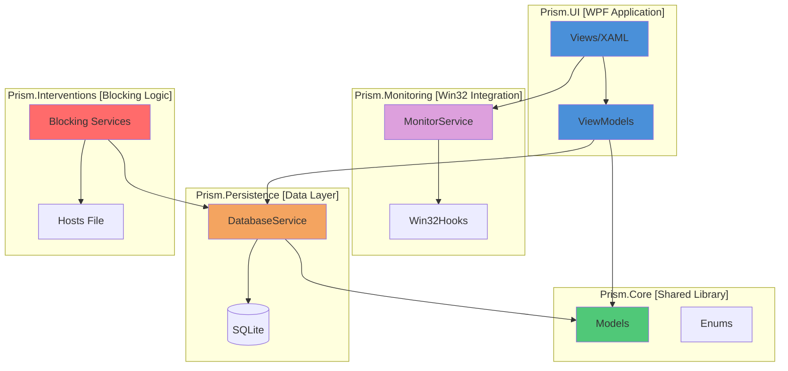
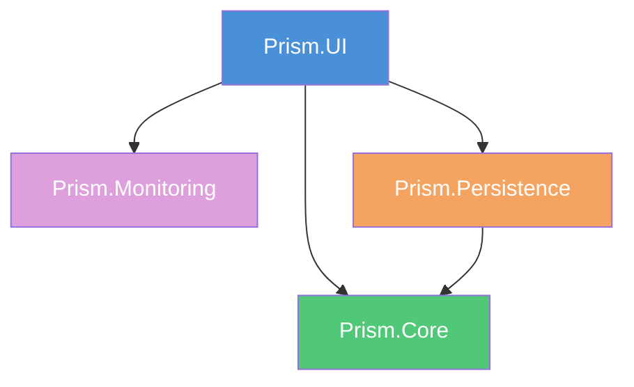
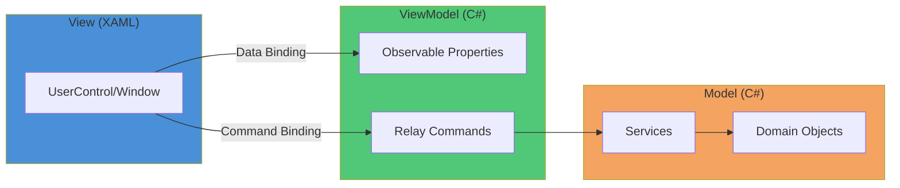
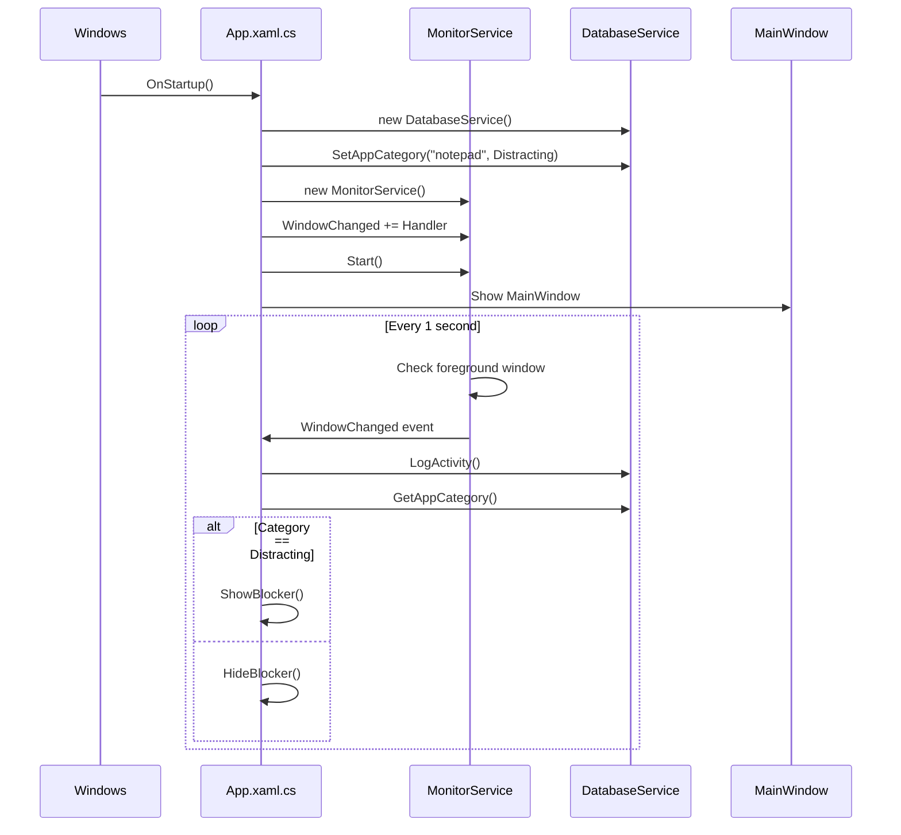
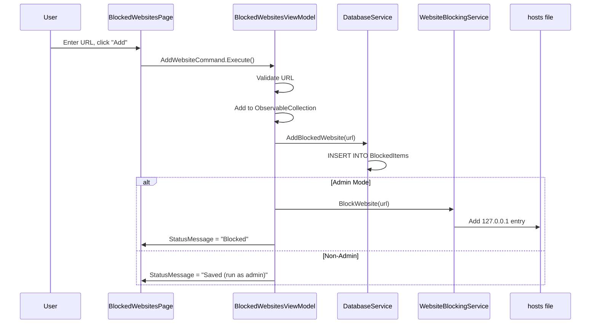
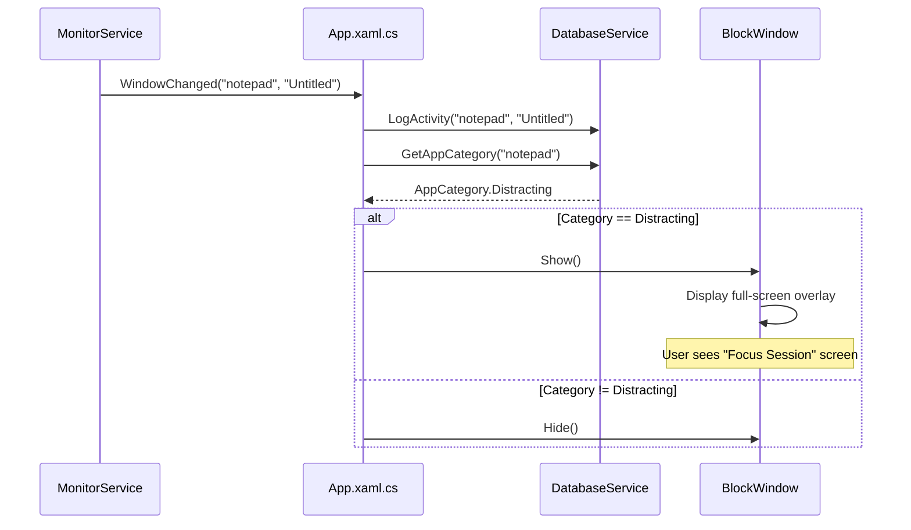
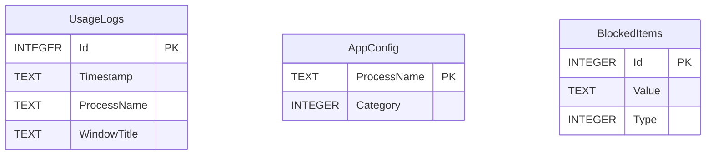

# Prism Architecture Guide

> A comprehensive architecture reference for Agentic AI to understand, navigate, and extend the Prism codebase.

---

## Table of Contents

1. [Overview](#overview)
2. [Solution Structure](#solution-structure)
3. [Project Dependencies](#project-dependencies)
4. [Technology Stack](#technology-stack)
5. [Architecture Patterns](#architecture-patterns)
6. [Project Deep Dives](#project-deep-dives)
7. [Data Flow](#data-flow)
8. [Key Components](#key-components)
9. [Database Schema](#database-schema)
10. [File Organization](#file-organization)
11. [Development Guidelines](#development-guidelines)
12. [Extension Points](#extension-points)

---

## Overview

**Prism** is a Windows-native, privacy-first screen-time management application. It helps users block distracting applications and websites through real-time monitoring and intervention overlays.

### Core Principles

| Principle | Description |
|-----------|-------------|
| **Local-Only** | All data stays on the user's machine. No cloud, no sync, no accounts. |
| **Privacy-First** | No telemetry, no external API calls. |
| **Modular** | Clean separation of concerns across 5 projects. |
| **MVVM** | UI follows Model-View-ViewModel pattern using CommunityToolkit.Mvvm. |

### High-Level Architecture



---

## Solution Structure

```
Prism/
├── Prism.sln                    # Visual Studio Solution
├── README.md                    # Project documentation
├── .gitignore                   # Git ignore rules
├── docs/                        # Documentation folder
│   ├── architecture.md          # This file
│   └── block.md                 # Blocking feature implementation guide
│
├── Prism.UI/                    # 🖥️ WPF Application (Entry Point)
│   ├── App.xaml                 # Application resources & styles
│   ├── App.xaml.cs              # Application lifecycle & monitoring
│   ├── MainWindow.xaml          # Main window with navigation shell
│   ├── MainWindow.xaml.cs       # Window code-behind
│   ├── Assets/                  # Images and resources
│   ├── Views/                   # XAML UserControls and Windows
│   └── ViewModels/              # MVVM ViewModels
│
├── Prism.Core/                  # 📦 Shared Domain Models
│   ├── Models/                  # Domain entities
│   │   └── AppUsage.cs          # Usage tracking model
│   └── Enums/                   # Enumerations
│       └── AppCategory.cs       # Neutral/Productive/Distracting
│
├── Prism.Monitoring/            # 👁️ Window Monitoring
│   ├── MonitorService.cs        # Background monitoring loop
│   └── Win32Hooks.cs            # P/Invoke declarations
│
├── Prism.Persistence/           # 💾 Data Storage
│   └── Services/
│       └── DatabaseService.cs   # SQLite operations
│
└── Prism.Interventions/         # 🚫 Blocking Logic (Stub)
    └── Class1.cs                # Placeholder for blocking services
```

---

## Project Dependencies

### Dependency Graph



### Project References

| Project | References | Description |
|---------|------------|-------------|
| **Prism.UI** | Core, Monitoring, Persistence | Main application, references all libraries |
| **Prism.Core** | None | Standalone, no dependencies |
| **Prism.Monitoring** | None | Standalone Win32 wrapper |
| **Prism.Persistence** | Core | Uses Core models for data types |
| **Prism.Interventions** | None (Future: Core, Persistence) | Will reference others for blocking |

---

## Technology Stack

### Framework & Runtime

| Component | Technology | Version |
|-----------|------------|---------|
| Runtime | .NET | 8.0 |
| UI Framework | WPF | Built-in |
| Target OS | Windows | 10/11 (x64) |

### NuGet Packages

#### Prism.UI

| Package | Version | Purpose |
|---------|---------|---------|
| `CommunityToolkit.Mvvm` | 8.4.0 | MVVM framework (ObservableObject, RelayCommand) |
| `MaterialDesignThemes` | 5.3.0 | Material Design UI components |
| `MaterialDesignColors` | 5.3.0 | Material Design color palette |
| `MahApps.Metro.IconPacks` | 6.2.1 | Icon library |
| `Hardcodet.NotifyIcon.Wpf` | 2.0.1 | System tray support |
| `Microsoft.Extensions.DependencyInjection` | 10.0.1 | DI container |
| `Microsoft.Extensions.Hosting` | 10.0.1 | Host builder pattern |
| `Microsoft.Toolkit.Uwp.Notifications` | 7.1.3 | Toast notifications |

#### Prism.Persistence

| Package | Version | Purpose |
|---------|---------|---------|
| `Microsoft.Data.Sqlite` | 10.0.1 | SQLite database access |

---

## Architecture Patterns

### MVVM (Model-View-ViewModel)

Prism uses the MVVM pattern with CommunityToolkit.Mvvm:



### Key MVVM Components

| Component | Implementation | Description |
|-----------|----------------|-------------|
| `ObservableObject` | Base class | Provides `INotifyPropertyChanged` |
| `[ObservableProperty]` | Attribute | Auto-generates property with notification |
| `[RelayCommand]` | Attribute | Auto-generates ICommand from method |
| `ObservableCollection<T>` | Collection | List with change notifications |

### Example: ViewModel Pattern

```csharp
public partial class BlockedWebsitesViewModel : ObservableObject
{
    // Auto-generates: public string NewWebsiteUrl { get; set; }
    // with INotifyPropertyChanged
    [ObservableProperty]
    private string _newWebsiteUrl = string.Empty;

    // Auto-generates: public IRelayCommand AddWebsiteCommand { get; }
    [RelayCommand]
    private void AddWebsite()
    {
        // Command logic here
    }
}
```

---

## Project Deep Dives

### Prism.UI (Entry Point)

**Type:** WPF Application (`WinExe`)

**Responsibilities:**
- Application lifecycle management
- MainWindow with navigation shell
- MVVM ViewModels and Views
- Resource dictionaries (themes, styles)
- Monitoring service orchestration

#### Key Files

| File | Purpose |
|------|---------|
| `App.xaml` | Global styles, brushes, themes (~800 lines) |
| `App.xaml.cs` | Startup, monitoring hooks, block window management |
| `MainWindow.xaml` | Navigation shell with sidebar |
| `ViewModels/MainViewModel.cs` | Navigation state, view switching |

#### Application Startup Flow



---

### Prism.Core (Domain Layer)

**Type:** Class Library

**Responsibilities:**
- Define domain models
- Define enumerations
- Shared types across all projects

#### Models

**`AppUsage.cs`**
```csharp
public class AppUsage
{
    public string ProcessName { get; set; }  // e.g., "chrome"
    public TimeSpan Duration { get; set; }   // Time spent
    public AppCategory Category { get; set; } // Productive/Distracting
    public DateTime Date { get; set; }       // When recorded
}
```

#### Enums

**`AppCategory.cs`**
```csharp
public enum AppCategory
{
    Neutral,      // 0 - Default, not categorized
    Productive,   // 1 - Work-related apps
    Distracting   // 2 - Block-worthy apps
}
```

---

### Prism.Monitoring (Win32 Integration)

**Type:** Class Library

**Responsibilities:**
- Poll active foreground window
- Extract process name and window title
- Fire events on window changes

#### Components

**`Win32Hooks.cs`** - P/Invoke Declarations

```csharp
public static class Win32Hooks
{
    [DllImport("user32.dll")]
    public static extern IntPtr GetForegroundWindow();

    [DllImport("user32.dll")]
    public static extern uint GetWindowThreadProcessId(IntPtr hWnd, out uint lpdwProcessId);

    [DllImport("user32.dll")]
    public static extern int GetWindowText(IntPtr hWnd, StringBuilder lpString, int nMaxCount);
}
```

**`MonitorService.cs`** - Background Monitor

| Method | Description |
|--------|-------------|
| `Start()` | Begins polling loop on background thread |
| `Stop()` | Cancels polling loop |
| `WindowChanged` | Event fired when foreground window changes |

#### Polling Loop

```csharp
private async Task MonitoringLoop(CancellationToken token)
{
    while (!token.IsCancellationRequested)
    {
        var hwnd = Win32Hooks.GetForegroundWindow();
        if (hwnd != _lastHwnd && hwnd != IntPtr.Zero)
        {
            _lastHwnd = hwnd;
            // Get process info and fire event
            WindowChanged?.Invoke(this, new WindowChangedEventArgs { ... });
        }
        await Task.Delay(1000, token);  // Poll every 1 second
    }
}
```

---

### Prism.Persistence (Data Layer)

**Type:** Class Library

**Responsibilities:**
- SQLite database creation and migration
- CRUD operations for all tables
- Data access abstraction

#### DatabaseService Methods

| Category | Method | Description |
|----------|--------|-------------|
| **Logging** | `LogActivity(process, title)` | Insert usage log |
| **Categories** | `SetAppCategory(process, category)` | Set/update app category |
| **Categories** | `GetAppCategory(process)` | Get category (default: Neutral) |
| **Stats** | `GetDailyStats(date)` | Get aggregated usage (stub) |
| **Blocked Apps** | `GetBlockedApplications()` | List blocked app names |
| **Blocked Apps** | `AddBlockedApplication(name)` | Add to block list |
| **Blocked Apps** | `RemoveBlockedApplication(name)` | Remove from block list |
| **Blocked Sites** | `GetBlockedWebsites()` | List blocked URLs |
| **Blocked Sites** | `AddBlockedWebsite(url)` | Add to block list |
| **Blocked Sites** | `RemoveBlockedWebsite(url)` | Remove from block list |

#### Database Location

```
%LOCALAPPDATA%\Prism\prism.db
```

Typically: `C:\Users\<Username>\AppData\Local\Prism\prism.db`

---

### Prism.Interventions (Blocking Layer)

**Type:** Class Library

**Current Status:** ⚠️ **STUB - NOT IMPLEMENTED**

**Future Responsibilities:**
- Website blocking via hosts file
- Application blocking via process termination
- Scheduling logic
- Bypass difficulty settings

> [!IMPORTANT]
> See `docs/block.md` for detailed implementation guide on the blocking feature.

---

## Data Flow

### User Adds Blocked Website



### Application Blocking Flow



---

## Key Components

### ViewModels Reference

| ViewModel | View | Purpose |
|-----------|------|---------|
| `MainViewModel` | `MainWindow` | Navigation, view switching |
| `WelcomeViewModel` | `WelcomePage` | First-run onboarding |
| `DashboardViewModel` | `DashboardPage` | Focus score, quick actions |
| `BlockedWebsitesViewModel` | `BlockedWebsitesPage` | Manage blocked URLs |
| `BlockedApplicationsViewModel` | `BlockedApplicationsPage` | Manage blocked apps |
| `BlockViewModel` | `BlockWindow` | Intervention overlay |
| `ScheduleViewModel` | (inline) | Placeholder |
| `StatsViewModel` | (inline) | Placeholder |
| `SettingsViewModel` | (inline) | Placeholder |

### Navigation System

Navigation is managed by `MainViewModel.CurrentViewModel`:

```csharp
// MainViewModel.cs
[ObservableProperty]
private object _currentViewModel;

[RelayCommand]
private void NavigateDashboard() => 
    CurrentViewModel = new DashboardViewModel(...);

[RelayCommand]
private void NavigateBlockedWebsites() => 
    CurrentViewModel = new BlockedWebsitesViewModel(...);
```

Views are resolved via `DataTemplate` in `MainWindow.xaml`:

```xml
<ContentControl Content="{Binding CurrentViewModel}">
    <ContentControl.Resources>
        <DataTemplate DataType="{x:Type viewmodels:DashboardViewModel}">
            <views:DashboardPage/>
        </DataTemplate>
        <!-- More templates... -->
    </ContentControl.Resources>
</ContentControl>
```

---

## Database Schema

### Tables



### Table Definitions

#### UsageLogs

| Column | Type | Description |
|--------|------|-------------|
| `Id` | INTEGER | Primary key, auto-increment |
| `Timestamp` | TEXT | ISO 8601 datetime string |
| `ProcessName` | TEXT | e.g., "chrome", "notepad" |
| `WindowTitle` | TEXT | Active window title |

#### AppConfig

| Column | Type | Description |
|--------|------|-------------|
| `ProcessName` | TEXT | Primary key, process name |
| `Category` | INTEGER | 0=Neutral, 1=Productive, 2=Distracting |

#### BlockedItems

| Column | Type | Description |
|--------|------|-------------|
| `Id` | INTEGER | Primary key, auto-increment |
| `Value` | TEXT | App name or URL |
| `Type` | INTEGER | 0=Application, 1=Website |

---

## File Organization

### Views (XAML Files)

| File | Type | Description |
|------|------|-------------|
| `WelcomePage.xaml` | UserControl | First-run onboarding UI |
| `DashboardPage.xaml` | UserControl | Main dashboard with actions |
| `BlockedWebsitesPage.xaml` | UserControl | Manage blocked websites |
| `BlockedApplicationsPage.xaml` | UserControl | Manage blocked applications |
| `BlockWindow.xaml` | Window | Full-screen intervention overlay |

### Naming Conventions

| Type | Convention | Example |
|------|------------|---------|
| Views (Pages) | `*Page.xaml` | `DashboardPage.xaml` |
| Views (Windows) | `*Window.xaml` | `BlockWindow.xaml` |
| ViewModels | `*ViewModel.cs` | `DashboardViewModel.cs` |
| Services | `*Service.cs` | `DatabaseService.cs` |
| Models | PascalCase noun | `AppUsage.cs` |
| Enums | PascalCase noun | `AppCategory.cs` |

---

## Development Guidelines

### Adding a New Page

1. **Create ViewModel** in `Prism.UI/ViewModels/`:
   ```csharp
   public partial class NewFeatureViewModel : ObservableObject
   {
       [ObservableProperty]
       private string _someProperty;

       [RelayCommand]
       private void SomeAction() { }
   }
   ```

2. **Create View** in `Prism.UI/Views/`:
   ```xml
   <UserControl x:Class="Prism.UI.Views.NewFeaturePage">
       <!-- XAML content -->
   </UserControl>
   ```

3. **Register DataTemplate** in `MainWindow.xaml`:
   ```xml
   <DataTemplate DataType="{x:Type viewmodels:NewFeatureViewModel}">
       <views:NewFeaturePage/>
   </DataTemplate>
   ```

4. **Add Navigation** in `MainViewModel`:
   ```csharp
   [RelayCommand]
   private void NavigateNewFeature() => 
       CurrentViewModel = new NewFeatureViewModel();
   ```

### Adding a Database Table

1. **Update `InitializeDatabase()`** in `DatabaseService.cs`:
   ```csharp
   command.CommandText = @"
       CREATE TABLE IF NOT EXISTS NewTable (
           Id INTEGER PRIMARY KEY AUTOINCREMENT,
           ...
       );
   ";
   ```

2. **Add CRUD methods** to `DatabaseService.cs`

3. **Create model** in `Prism.Core/Models/` if needed

### Working with Win32 APIs

1. **Add P/Invoke declaration** in `Win32Hooks.cs`:
   ```csharp
   [DllImport("user32.dll")]
   public static extern ReturnType FunctionName(params);
   ```

2. **Use safely** with try/catch and null checks

3. **Run on appropriate thread** (UI thread for UI changes)

---

## Extension Points

### Where to Add Features

| Feature | Location | Notes |
|---------|----------|-------|
| New blocking strategy | `Prism.Interventions` | See `docs/block.md` |
| New UI page | `Prism.UI/Views` + `ViewModels` | Follow MVVM pattern |
| New data storage | `Prism.Persistence` | Extend `DatabaseService` |
| New Win32 hook | `Prism.Monitoring` | Add to `Win32Hooks.cs` |
| New domain model | `Prism.Core/Models` | Keep it simple, POCOs only |
| New theme/style | `Prism.UI/App.xaml` | Use existing brush naming |

### Planned Features (Roadmap)

| Feature | Status | Affected Projects |
|---------|--------|-------------------|
| Schedule System | Not Started | UI, Persistence, Interventions |
| Analytics Dashboard | Not Started | UI, Persistence |
| Strict Mode | Not Started | Interventions |
| Web Blocking | Documented | Interventions (see `block.md`) |
| System Tray | Partial | UI |

---

## Useful Commands

### Build & Run

```powershell
# Build entire solution
dotnet build Prism.sln

# Run the application
dotnet run --project Prism.UI

# Run with hot reload
dotnet watch --project Prism.UI
```

### Database Management

```powershell
# View database location
echo $env:LOCALAPPDATA\Prism\prism.db

# Reset welcome screen
Remove-Item "$env:LOCALAPPDATA\Prism\welcome_completed" -ErrorAction SilentlyContinue

# Full reset (delete all data)
Remove-Item -Recurse -Force "$env:LOCALAPPDATA\Prism"
```

### Debugging

```powershell
# View hosts file (for website blocking)
Get-Content C:\Windows\System32\drivers\etc\hosts

# Flush DNS cache (after blocking changes)
ipconfig /flushdns
```

---

## Quick Reference Card

```
┌─────────────────────────────────────────────────────────────────┐
│                        PRISM ARCHITECTURE                       │
├─────────────────────────────────────────────────────────────────┤
│                                                                 │
│  ┌─────────────┐     ┌─────────────┐     ┌─────────────┐       │
│  │  Prism.UI   │────▶│ Prism.Core  │◀────│ Prism.Pers. │       │
│  │   (WPF)     │     │  (Models)   │     │  (SQLite)   │       │
│  └──────┬──────┘     └─────────────┘     └─────────────┘       │
│         │                                                       │
│         ▼                                                       │
│  ┌─────────────┐     ┌─────────────┐                           │
│  │Prism.Monitor│     │Prism.Interv.│  ◀── NOT IMPLEMENTED      │
│  │  (Win32)    │     │  (Blocking) │                           │
│  └─────────────┘     └─────────────┘                           │
│                                                                 │
├─────────────────────────────────────────────────────────────────┤
│  MVVM Pattern: View ←──binds──▶ ViewModel ←──uses──▶ Model     │
│  Navigation:   MainViewModel.CurrentViewModel switches views   │
│  Database:     %LOCALAPPDATA%\Prism\prism.db                   │
│  Framework:    .NET 8.0, WPF, CommunityToolkit.Mvvm            │
└─────────────────────────────────────────────────────────────────┘
```
